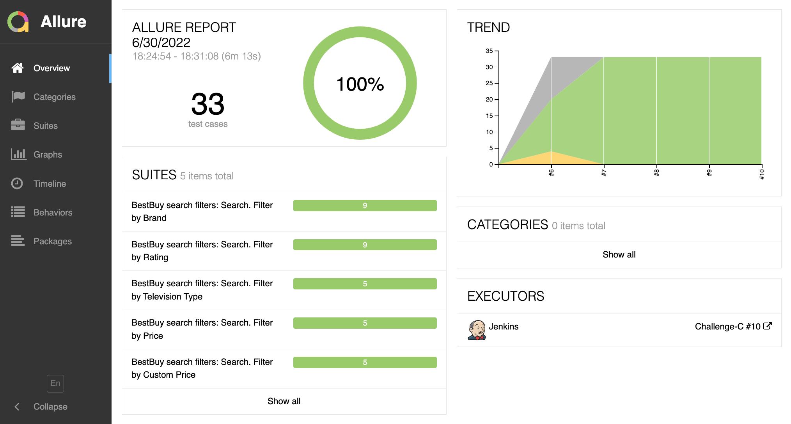

<div id="top"></div>
<!--
*** Thanks for checking out the Best-README-Template. If you have a suggestion
*** that would make this better, please fork the repo and create a pull request
*** or simply open an issue with the tag "enhancement".
*** Don't forget to give the project a star!
*** Thanks again! Now go create something AMAZING! :D
-->


<!-- PROJECT SHIELDS -->
<!--
*** I'm using markdown "reference style" links for readability.
*** Reference links are enclosed in brackets [ ] instead of parentheses ( ).
*** See the bottom of this document for the declaration of the reference variables
*** for contributors-url, forks-url, etc. This is an optional, concise syntax you may use.
*** https://www.markdownguide.org/basic-syntax/#reference-style-links
-->
[![Contributors][contributors-shield]][contributors-url]
[![Forks][forks-shield]][forks-url]
[![Stargazers][stars-shield]][stars-url]
[![Issues][issues-shield]][issues-url]
[![MIT License][license-shield]][license-url]
[![LinkedIn][linkedin-shield]][linkedin-url]


<!-- PROJECT LOGO -->
<br />
<div align="center">
  <a href="https://github.com/dheredia-ok/challenge-c">
    
  </a>

<h3 align="center">Automation Challenge C</h3>

  <p align="center">
    Automation for Test Cases created for the BestBuy website.
    <br />
    <a href="https://github.com/dheredia-ok/challenge-c/tree/master/documents"><strong>Explore the docs »</strong></a>
    <br />
    <br />
    <a href="https://youtu.be/BusfBKbZ9VA">View Demo</a>
    ·
    <a href="https://github.com/dheredia-ok/challenge-c/issues">Report Bug</a>
    ·
    <a href="https://github.com/dheredia-ok/challenge-c/issues">Request Feature</a>
  </p>
</div>


<!-- TABLE OF CONTENTS -->
<details>
  <summary>Table of Contents</summary>
  <ol>
    <li>
      <a href="#about-the-project">About The Project</a>
      <ul>
        <li><a href="#built-with">Built With</a></li>
      </ul>
    </li>
    <li>
      <a href="#getting-started">Getting Started</a>
      <ul>
        <li><a href="#prerequisites">Prerequisites</a></li>
        <li><a href="#installation">Installation</a></li>
      </ul>
    </li>
    <li><a href="#usage">Usage</a></li>
    <li><a href="#contact">Contact</a></li>
  </ol>
</details>


<!-- ABOUT THE PROJECT -->
## About The Project

This project is the automation of the tests created for the Automation Challenge C, that are defined in the [Test Case Matrix]([https://docs.google.com/spreadsheets/d/1TyN3G0ziZMpRgq2scoZi7lVQVA-6F4GAXfbh75H-kms/edit?usp=sharing](https://github.com/dheredia-ok/challenge-c/blob/d42a0a8bd21376c2ea58c4ab366bde072949fc7b/documents/Automation%20Challenge%20C%20-%20Test%20Case%20Matrix%20-%20Test%20Cases.pdf)).

They represent Functional Tests for the search functionality of the [BestBuy website](https://www.bestbuy.com/). Each case consists in the search for certain item (such as a laptop, cellphone, TV, etc.). The results should reflect the application of a defined filter.

The test cases ran by this application are the following:

* Search for 'Laptop' and filter by Brand: 'Asus', 'Dell', 'Lenovo'
* Search for 'Television' and filter by Television Type: 'Smart'
* Search for 'Cell Phones' and filter by Rating: '2 & Up', '3 & Up', '4 & Up'
* Search for 'Camera' and filter by Price: '25 to 49.99'
* Search for 'Smartwatch' and filter by Price (Custom): '100 to 200'

<p align="right">(<a href="#top">back to top</a>)</p>


### Built With

* [WebdriverIO](https://webdriver.io/)
* [Cucumber](https://cucumber.io/)

The tools used to create this project were WebdriverIO (using JavaScript) to create the automation itself, and Cucumber, used to create the natural-language instructions and set the parameters needed to run the test cases.

<p align="right">(<a href="#top">back to top</a>)</p>

<!-- GETTING STARTED -->
## Getting Started

In this section, the steps for installing the project are described. At the end, it would be possible to trigger the execution of the test cases from Jenkins, and to check a generated report.

### Prerequisites

Jenkins can be downloaded and installed from its [website](https://www.jenkins.io/).
Right after installing Jenkins, it is recommended to install the suggested plugins, and later, install and configure Allure and NodeJS.

To install the Allure and NodeJS plugins, go to...
```sh
Dashboard > Manage Jenkins > Manage Plugins > Available
```

After installing them, go to...
```sh
Dashboard > Manage Jenkins > Global Tool Configuration
```
Then, make sure that there is...
* An active NodeJS installation and
* An active Allure Commandline installation


### Installation

1. Create a Freestyle project and enter a name for it.
2. In the "Source Code Management" section, select "Git", and paste the following repository URL: https://github.com/dheredia-ok/challenge-c.git
3. Add your GitHub credentials: 
    * Click on Credentials / Add
    * On "Kind", select "Username and Password"
    * Write your GitHub Username and Password.
    * Click on Add.
4. In the Build section, add two steps: both of them are going to be "Execute Shell". Both steps will have the following instructions:
    * Step 1: 
       ```sh
       npm install
       ```
    * Step 2: 
       ```sh
       npx wdio
      ```

<p align="right">(<a href="#top">back to top</a>)</p>


<!-- USAGE EXAMPLES -->
## Usage

After the installation of Jenkins and its necessary plugins, the next step is to run the job. In the job page, click on the "Build Now" option.

1. Then, a Chrome window will appear, and the tests will run one after the other.
2. After the job is run, an Allure Report icon will be visible. Click on the icon to see the generated report.
3. The generated report covers the following points:
    * Performance of each test case per scenario (which passed and which failed)
    * The execution time for every step and for the whole test
    * Screenshots in case of an error
    * Graphic summary of the trend: Information about the previous runs

<p align="right">(<a href="#top">back to top</a>)</p>


<p align="center">
  The Generated Report
</p>


<!-- CONTACT -->
## Contact

David Heredia - david.heredia@oktana.com

Project Link: [https://github.com/dheredia-ok/challenge-c](https://github.com/dheredia-ok/challenge-c)

<p align="right">(<a href="#top">back to top</a>)</p>


<!-- MARKDOWN LINKS & IMAGES -->
<!-- https://www.markdownguide.org/basic-syntax/#reference-style-links -->
[contributors-shield]: https://img.shields.io/github/contributors/dheredia-ok/challenge-c.svg?style=for-the-badge
[contributors-url]: https://github.com/dheredia-ok/challenge-c/graphs/contributors
[forks-shield]: https://img.shields.io/github/forks/dheredia-ok/challenge-c.svg?style=for-the-badge
[forks-url]: https://github.com/dheredia-ok/challenge-c/network/members
[stars-shield]: https://img.shields.io/github/stars/dheredia-ok/challenge-c.svg?style=for-the-badge
[stars-url]: https://github.com/dheredia-ok/challenge-c/stargazers
[issues-shield]: https://img.shields.io/github/issues/dheredia-ok/challenge-c.svg?style=for-the-badge
[issues-url]: https://github.com/dheredia-ok/challenge-c/issues
[license-shield]: https://img.shields.io/github/license/dheredia-ok/challenge-c.svg?style=for-the-badge
[license-url]: https://github.com/dheredia-ok/challenge-c/blob/master/LICENSE.txt
[linkedin-shield]: https://img.shields.io/badge/-LinkedIn-black.svg?style=for-the-badge&logo=linkedin&colorB=555
[linkedin-url]: https://pe.linkedin.com/in/davidheredia933
[product-screenshot]: images/screenshot.png
